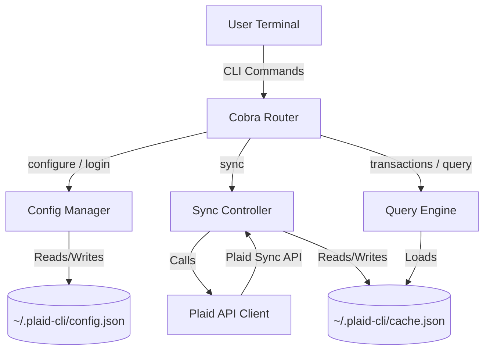

# Plaid CLI: Feature Specification & Architecture Roadmap

This document outlines the design specification and future development roadmap for the `plaid-cli` tool. The goal is to build a robust, secure, and developer-friendly command-line interface for managing personal finance data retrieved via the Plaid API.

---

## 🎯 Vision

`plaid-cli` is a developer-centric personal finance tool that lives in the terminal. It provides:
1. **Full Ownership of Data**: Securely caches all banking records locally in plaintext or encrypted formats.
2. **Aggregated Multi-Account Views**: Seamlessly handles multiple bank accounts, credit cards, loans, and brokerage/investment accounts across different financial institutions.
3. **Advanced Analytics & Scriptability**: Exposes powerful querying interfaces (SQL, date ranges, filters) and supports clean JSON/CSV exports for piping into other tools.
4. **Actionable CLI Budgets**: Rules engines, category tracking, and ASCII-based visualizations directly in the shell.

---

## 🏗️ Core Architecture



### File Formats & Schema

#### `~/.plaid-cli/config.json`

Stores Plaid API credentials and linked Item metadata.

```json
{
  "client_id": "PLAID_CLIENT_ID",
  "secret": "PLAID_SECRET",
  "environment": "sandbox|production",
  "secure": false,
  "items": [
    {
      "item_id": "item_id_1",
      "access_token": "access-sandbox-xxxxxx",
      "institution_id": "ins_3",
      "institution_name": "Chase",
      "accounts": [
        { "account_id": "acc_abc", "name": "Rewards Checking", "mask": "5528", "subtype": "checking" }
      ]
    }
  ]
}
```

`institution_id` and `institution_name` are fetched from `/item/get` + `/institutions/get_by_id` at link time and cached alongside the token. Any item missing these fields will have them backfilled automatically the next time `accounts remove` is run.

`accounts` is a cached per-account directory (`account_id` → name/mask/subtype) refreshed from Plaid whenever accounts are fetched (`accounts` and `sync`). It lets offline commands render a human-readable account label without a live API call: `transactions` shows `Name (shortid)` (e.g. `Rewards Checking (LAX6Q4M1)`) in its `ACCOUNT` column and adds an `Account` column to CSV while preserving the full `Account ID`. The raw account ID — needed for `rules --account-id` and `transactions --account-id` — remains the canonical reference in the `accounts` table.

When `secure: true`, the entire file is AES-256-GCM encrypted on disk (see [Local Cache Encryption](#-local-cache-encryption-implemented)).

#### `~/.plaid-cli/cache.json`

Caches cursor checkpoints, full transaction records, and rule-generated overrides locally. (Liabilities and Investments are fetched live and not cached today; the `securities`/`holdings`/`investment_transactions` blocks below are the **planned** target schema for the future cached-investments enhancement — see [Investments](#-investments-implemented).)

```json
{
  "cursors": {
    "item_id_1": "cursor_string_xyz..."
  },
  "transactions": [
    {
      "transaction_id": "tx_123",
      "account_id":     "acc_abc",
      "amount":         42.50,
      "date":           "2026-05-21",
      "name":           "Target Store",
      "pending":        false,
      "category":       ["Shops", "Supermarkets and Groceries"]
    }
  ],
  "overrides": {
    "tx_abc123": {
      "display_name": "Electric Bill",
      "category":     "Bills & Utilities > Electric",
      "tags":         ["reimbursement"],
      "ignored":      false,
      "rule_id":      "rule_abc123",
      "manual":       false
    }
  },
  "securities": [
    {
      "security_id":   "sec_xyz",
      "ticker_symbol": "VTI",
      "name":          "Vanguard Total Stock Market ETF",
      "type":          "etf",
      "cusip":         "922908769",
      "isin":          "US9229087690",
      "close_price":   258.13,
      "iso_currency_code": "USD"
    }
  ],
  "holdings": [
    {
      "account_id":             "acc_brokerage",
      "security_id":            "sec_xyz",
      "quantity":               12.5,
      "cost_basis":             2900.00,
      "institution_price":      258.13,
      "institution_value":      3226.63,
      "iso_currency_code":      "USD",
      "as_of":                  "2026-05-21"
    }
  ],
  "investment_transactions": [
    {
      "investment_transaction_id": "itx_123",
      "account_id":  "acc_brokerage",
      "security_id": "sec_xyz",
      "date":        "2026-05-20",
      "name":        "BUY VANGUARD TOTAL STOCK MKT ETF",
      "type":        "buy",
      "subtype":     "buy",
      "quantity":    1.0,
      "price":       257.40,
      "amount":      257.40,
      "fees":        0.00,
      "iso_currency_code": "USD"
    }
  ]
}
```

> The `securities` / `holdings` / `investment_transactions` blocks are **planned** (Investments feature); they are documented here as the target schema. Holdings are a **snapshot** — each fetch replaces the prior snapshot wholesale (with an `as_of` date) rather than merging, because they represent point-in-time state, not an append-only ledger. Investment transactions are append-and-dedupe on `investment_transaction_id`, like banking transactions. `securities` is a shared reference table keyed by `security_id` that both holdings and investment transactions join against.

#### `~/.plaid-cli/session.json`

Encrypted password session cache (see [Session Caching](#session-caching)).

#### `~/.plaid-cli/rules.json`

User-defined categorization rules (see [Rules Engine](#️-rules-engine--custom-auto-categorization-implemented)).

---

## 🔗 Multi-Account Support (Implemented)

`plaid-cli` supports linking and tracking multiple bank accounts (Plaid Items) simultaneously:

1. **Config Storage**: Access tokens are stored in the `items` list in `config.json`. Institution name and ID are fetched from Plaid at link time and stored with each item so they are available for display without additional API calls.
2. **Aggregated Balance Retrieval**: The `accounts` command fetches balances from all linked items and presents them in a unified table.
3. **Cursor-by-Item Syncing**: `sync` maintains a cursor per Item ID in `cache.json`, ensuring incremental updates are isolated per institution.

### Duplicate Prevention

Before appending a new Item, `login` checks whether the returned `item_id` already exists in `config.json`. If found, the existing entry is updated in place (token + institution metadata refreshed) rather than duplicated. This prevents repeated `login` invocations from accumulating stale entries.

### Account Removal

```text
plaid-cli accounts remove [item_id|account_id|number]
```

On startup, `accounts remove` fetches and backfills any missing `institution_name` values, then:

1. If an argument is given, resolves it in order: **list index** (1-based integer) → **item ID** → **account ID** (walks each item's accounts via Plaid to find the owner).
2. If no argument is given, prints a numbered list of institutions and prompts for a selection.
3. Displays the institution name (not the raw item ID) in the confirmation prompt: `Remove "Chase"? [y/N]`
4. On confirmation:
   - Collects account IDs for the item (needed for cache purge).
   - Calls Plaid `/item/remove` to invalidate the access token server-side.
   - Removes the entry from `config.json`.
   - Deletes the cursor for that item and purges all matching transactions from `cache.json`.
5. Prints how many cached transactions were purged and confirms removal.

**Flags:**

| Flag      | Description                                      |
| ----------- | -------------------------------------------------- |
| `--force` | Skip the confirmation prompt (useful in scripts) |

---

## 🔐 Local Cache Encryption (Implemented)

`config.json` and `cache.json` are encrypted at rest when `secure: true` is set. Encryption is enabled during `configure`.

- **Algorithm**: AES-256-GCM with a key derived from the master password using PBKDF2 (random salt stored in the encrypted envelope).
- **Envelope format**: `{"encrypted": true, "salt": "...", "nonce": "...", "ciphertext": "..."}` — unambiguously detectable so the CLI knows to decrypt before parsing.
- **Password resolution order** (applied to every command that reads config or cache):
  1. In-memory (already entered this process)
  2. `PLAID_CLI_PASSWORD` environment variable
  3. Session cache (`~/.plaid-cli/session.json`) — see below
  4. Interactive terminal prompt (`Enter master password:`)
- **Non-interactive fallback**: if stdin is not a terminal and no password is available via environment or session, the command exits with a clear error.

### Session Caching

To avoid re-entering the master password on every command invocation, the CLI maintains a short-lived session at `~/.plaid-cli/session.json`.

- **Expiry**: 15 minutes from last use. Each successful read slides the window forward.
- **Encryption**: the session file is AES-GCM encrypted using a machine-derived key (SHA-256 of `hostname + home directory path`). This ties the session to the machine without requiring a second password.
- **Permissions**: written with mode `0600`.
- On decryption failure or expiry, the session file is deleted and the user is prompted to re-enter their password.
- `ClearSession()` is called whenever a decryption attempt on config or cache fails, preventing stale session data from blocking access.

**`configure` flags:**

| Flag | Description |
| ------ | ------------- |
| `--secure` | Enable AES-256-GCM encryption for config and cache |

---

## 💳 Plaid Environments & Sandbox Credentials

`plaid-cli` supports two Plaid environments: `sandbox` and `production`.

- **Sandbox**: unlimited test Items, no real bank credentials required.
  - Username: `user_good` / Password: `pass_good`
  - Simulates checking, savings, credit cards, and investments instantly.
  - Can trigger error states (e.g. `ITEM_LOGIN_REQUIRED`) to test re-linking and OAuth flows.
- **Production**: up to 100 live Items on the free Developer tier; full real-bank data.

Historical transaction depth: up to **730 days (2 years)** requested via `SetDaysRequested(730)` in the Link Token. The initial sync delivers the most recent 30 days immediately (`INITIAL_UPDATE`); older history is fetched asynchronously by Plaid in 1–2 minutes and available after a second `sync` run (`HISTORICAL_UPDATE`).

### Product Scopes & Link Token

Plaid gates each data set behind a **product** that must be requested when the Link Token is created. [`CreateLinkToken`](pkg/client/plaid.go:34) requests `transactions` as the primary product and both `liabilities` and `investments` as [`required_if_supported_products`](https://plaid.com/docs/api/link/#link-token-create-request-required-if-supported-products) entries:

| Product | Link-token slot | Endpoint(s) | Enables |
| --------- | --------------- | ------------- | --------- |
| `transactions` | `products` | `/transactions/sync` | `sync`, `transactions` |
| `liabilities` | `required_if_supported_products` | `/liabilities/get` | `liabilities` |
| `investments` | `required_if_supported_products` | `/investments/holdings/get`, `/investments/transactions/get` | `investments holdings`, `investments transactions` |

Important constraints (verify against current Plaid docs):

- **`required_if_supported_products`, not `products`.** Putting `liabilities`/`investments` in the primary `products` array would make linking *fail* at institutions that don't offer them. The `required_if_supported_products` slot initializes a product where the institution supports it and silently omits it elsewhere, so a single Link flow works across all banks.
- **Existing Items aren't upgraded automatically.** An Item linked before a product was added (or at an institution that gained support later) won't carry that data until it is re-linked. Adding a product to an existing Item requires **[update mode](https://plaid.com/docs/link/update-mode/)** — a re-link that keeps the same `item_id`/`access_token` and does **not** create a new Item. A dedicated `login --update` path is a planned follow-up; for now, re-running `login` (which updates the matching `item_id` in place) is the workaround.
- **Institution support varies.** Requesting `investments` for a cash-only bank, or `liabilities` for a brokerage, surfaces a `PRODUCTS_NOT_SUPPORTED`-class error or simply returns no accounts of that kind. The `liabilities` and `investments` commands degrade gracefully per item — they warn and continue rather than aborting the run.
- **Billing.** Liabilities and Investments are separately metered Plaid products; enabling them affects production billing. They remain free in `sandbox` (`user_good` / `pass_good` returns synthetic loans, cards, and holdings).

---

## 🛠️ Implemented Commands

### `configure`

Set up Plaid API credentials. Prompts interactively for any values not supplied via flags. Re-running `configure` preserves existing linked Items.

| Flag | Description |
| ------ | ------------- |
| `--client-id` | Plaid Client ID |
| `--secret` | Plaid Client Secret |
| `--environment` | `sandbox` or `production` |
| `--secure` | Enable AES-256-GCM encryption |

### `login`

Open a browser-based Plaid Link flow via a temporary local server to authenticate a bank account. Exchanges the public token for an access token, fetches institution metadata, and stores everything in `config.json`. Safe to run multiple times — duplicate item IDs are updated rather than duplicated.

| Flag | Description |
| ------ | ------------- |
| `--port` | Local port for the Link flow page (default `8080`) |

### `accounts`

Fetch and display real-time balances for all linked items in a unified table (account ID, name, type/subtype, current balance, available balance, currency).

#### `accounts remove [item_id|account_id|number]`

Remove a linked institution. See [Account Removal](#account-removal) for full behavior.

| Flag | Description |
| ------ | ------------- |
| `--force` | Skip confirmation prompt |

### `sync`

Incrementally fetch transaction changes (added, modified, removed) from Plaid using cursor-based sync and write them to `cache.json`. After saving, automatically runs all enabled rules against the changed transactions and reports the override count.

| Flag | Description |
| ------ | ------------- |
| `--item-id` | Sync only the specified Plaid Item ID |
| `--account-id` | Resolve to the parent item and sync only that institution |
| `--reset` | Clear cursors and re-fetch full history from scratch |

`--item-id` and `--account-id` are mutually exclusive. `--reset` with a targeted flag resets only the matched item's cursor and cached transactions.

### `transactions`

Query and display transactions from the local cache with extensive filtering. Sorted by date descending. When run in a terminal with no date filter specified, presents an interactive prompt:

```
[1] Last 30 days
[2] Last 60 days
[3] Last 90 days
[4] All transactions (no filter)
```

In non-interactive (piped) mode, defaults to all transactions.

| Flag | Description |
| ------ | ------------- |
| `--start-date YYYY-MM-DD` | Show transactions on or after this date |
| `--end-date YYYY-MM-DD` | Show transactions on or before this date |
| `--days N` | Show transactions from the last N days (mutually exclusive with `--start-date`/`--end-date`) |
| `--account-id` | Filter by Plaid account ID |
| `--min-amount` | Lower bound (inclusive) on transaction amount |
| `--max-amount` | Upper bound (inclusive) on transaction amount |
| `--search` | Case-insensitive substring search on transaction name |
| `--pending` | Show only pending transactions |
| `--limit N` | Cap the number of displayed results (default 100) |
| `--format table\|json\|csv` | Output format (default `table`) |
| `--output FILE` | Write output to a file instead of stdout |
| `--no-rules` | Show raw Plaid data without applying rule overrides |
| `--tag TAG` | Show only transactions with this override tag |
| `--ignored` | Show only transactions marked ignored by a rule |

### `liabilities`

Fetch and display credit card, student loan, and mortgage liability detail live from Plaid. See [Liabilities](#-liabilities-implemented) for full behavior and surfaced fields.

| Flag | Description |
| ------ | ------------- |
| `--type credit\|student\|mortgage` | Show only one liability class |
| `--item-id` | Limit to a single Plaid Item ID |
| `--account-id` | Limit to a single account |
| `--format table\|json\|csv` | Output format (default `table`) |
| `--output FILE` | Write output to a file instead of stdout |

### `investments`

Inspect brokerage/retirement accounts live from Plaid via two subcommands. See [Investments](#-investments-implemented) for full behavior.

- **`investments holdings`** — current positions with market value and unrealized gain/loss.
- **`investments transactions`** — investment activity (buy/sell/dividend/fee) over a date window.

| Flag | Subcommand | Description |
| ------ | ----------- | ------------- |
| `--item-id` / `--account-id` | both | Scope to one item or account |
| `--format table\|json\|csv` | both | Output format (default `table`) |
| `--output FILE` | both | Write output to a file instead of stdout |
| `--start-date` / `--end-date` / `--days N` | transactions | Date window (defaults to last 365 days) |
| `--type` | transactions | Filter by transaction type or subtype |
| `--limit N` | transactions | Cap displayed results (default 100) |

---

## 🏷️ Rules Engine & Custom Auto-Categorization (Implemented)

Plaid's default transaction categorization can be noisy or inaccurate. A local rules engine allows users to override names, categories, and tags without mutating raw Plaid data.

**Non-destructive override layer.** Rules never modify `transactions[]`. Instead, `cache.json` carries an `overrides` map keyed by `transaction_id`. Rules populate this map; `transactions` merges overrides at render time. Manual per-transaction edits (future TUI feature) coexist here — `manual: true` overrides take priority over rule-generated ones.

**Override provenance (`source`).** Each override records what produced it: `"rule"` (auto-categorization), `"correlate"` (cross-account payment matching, see below), or empty for legacy/manual entries. `rules apply` only ever clobbers or garbage-collects `"rule"` overrides — `manual: true` and `source: "correlate"` overrides are always preserved.

### `~/.plaid-cli/rules.json` schema

```json
{
  "rules": [
    {
      "id": "rule_abc123",
      "name": "Venmo Electric Bill",
      "enabled": true,
      "conditions": {
        "name_contains": "VENMO",
        "amount_min": 50.0,
        "amount_max": 200.0
      },
      "actions": {
        "rename": "Electric Bill",
        "set_category": "Bills & Utilities > Electric",
        "tags": ["reimbursement"],
        "ignore": false
      }
    }
  ]
}
```

**Conditions** (all present conditions must match — AND logic):

| Field | Match type |
| ------- | ----------- |
| `name_contains` | Case-insensitive substring on transaction name |
| `name_regex` | Full Go regex on transaction name |
| `account_id` | Exact match on Plaid account ID |
| `amount_min` / `amount_max` | Inclusive bounds on transaction amount |
| `category_is` | Case-insensitive substring on Plaid's auto-assigned category string |

**Actions** (all non-empty fields applied):

| Field | Effect |
| ------- | -------- |
| `rename` | Display name override |
| `set_category` | User-defined category string |
| `tags` | String slice (e.g. `["tax-deductible", "reimbursable"]`) |
| `ignore` | `true` hides the transaction from budget/spend summaries |

### Rules commands

| Command | Flags | Description |
| --------- | ------- | ------------- |
| `rules list` | `--format table\|json` | Print all rules |
| `rules add` | `--name`, `--match`, `--regex`, `--account-id`, `--min-amount`, `--max-amount`, `--category-is`, `--set-category`, `--rename`, `--tag` (repeatable), `--ignore` | Add a rule; prompts interactively for omitted fields when run in a terminal |
| `rules remove <id>` | — | Delete a rule by ID |
| `rules enable <id>` | — | Enable a disabled rule |
| `rules disable <id>` | — | Disable a rule without deleting it |
| `rules apply` | `--dry-run` | Re-run all enabled rules against the full cache; `--dry-run` prints matches without writing |
| `rules test` | `--match`, `--regex`, `--min-amount`, `--max-amount` | Dry-run a one-off condition against the cache and print matches |
| `rules correlate` | `--dry-run`, `--days`, `--name`, `--source-account`, `--source-type`, `--dest-type`, `--no-ignore`, `--offline` | Classify inter-account payments by matching transfers across accounts (see below) |

> **Note**: `rules test` supports only name/amount conditions. To test `account_id` or `category_is` conditions, use `rules add` without saving (Ctrl-C) or `rules apply --dry-run` after temporarily adding the rule.

### Cross-Account Payment Correlation (`rules correlate`)

The rules engine evaluates one transaction against its own fields, so it cannot express "this checking debit is the credit-card payment that settled that card's credit." Credit-card and loan payments compound this: they appear as a generic outbound transfer whose amount is the **statement balance or installment due**, which changes every period — there is no stable name, amount, or account condition a rule could pin.

`rules correlate` solves this out-of-band. It pairs each outbound payment debit with the **equal-and-opposite credit on another linked account** within a settlement window (`--days`, default 3). Payments are identified by **Plaid account type**, not transaction name, so the feature is bank-agnostic: by default a debit on a `depository` account (cash leaving checking/savings) is matched to a credit on a `credit` or `loan` account — a card payment or an installment paydown (mortgage, student, auto). The debit is then labeled from the destination type (`Payment: <name>` / `Transfer: Credit Card Payment` for credit, `Payment: <name>` / `Transfer: Loan Payment` for loan) and, by default, marked `ignore` so the payment is not double-counted against the purchases already recorded on the destination account.

- **Type-driven, bank-agnostic.** `--source-type` (default `depository`) and `--dest-type` (default `credit,loan`) gate the two sides; pass empty values to match any type (e.g. `--dest-type ""` to also capture savings sweeps, which then read as `Transfer: Account Transfer`).
- **Self-limiting / safe.** A transfer whose money does not land on another linked account of a destination type (an external payee, a mortgage paid to a non-linked servicer, a savings sweep when only credit/loan are destinations) has no qualifying counter-credit and is never touched.
- **Greedy, one-to-one matching.** Each credit is consumed by at most one debit; debits are processed oldest-first for deterministic pairs.
- **Account names and types** are resolved via a best-effort Plaid `/accounts/get` lookup. `--offline` skips the lookup, which disables type filters (types are then unknown) and labels by account ID. `--name` optionally narrows the debit side by substring; `--source-account` restricts it to a single account; `--no-ignore` keeps matched payments visible in spend summaries.
- Overrides are written with `source: "correlate"` so they survive subsequent `rules apply` runs. Re-running `rules correlate` first drops its own prior overrides, then recomputes.

### Integration with `sync` and `transactions`

- `sync` — after saving the cache, automatically calls `rules.ApplyAll()` on newly added/modified transaction IDs only. Reports the override count in the sync summary.
- `transactions` — after filtering, calls `rules.MergeOverrides()` to produce display-ready records before rendering. `--no-rules` bypasses this and shows raw Plaid data. `--tag` and `--ignored` filter on override fields.

---

## 💼 Liabilities (Implemented)

Plaid's **Liabilities** product (`/liabilities/get`) returns the debt-side detail that `accounts` balances alone can't express: statement balances, APRs, payment due dates, interest rates, and payoff projections for **credit cards**, **student loans**, and **mortgages**. This closes the largest gap against the upstream Plaid CLI and feeds the planned `networth` and budget reports.

`/liabilities/get` returns a per-account block grouped by liability type. Like `accounts`, the `liabilities` command fetches **live** from Plaid on each run (it is not cached) and resolves `account_id` → human-readable label from the `accounts` array returned alongside the liabilities — no separate `/accounts/get` call. Offline snapshot caching is deferred to the `networth` work (see Roadmap §5).

### `liabilities`

Fetch and display liability detail for all linked items that carry a `credit` or `loan` account. Items with no liability accounts — or whose institution does not support the Liabilities product — are skipped with a warning, and the command continues.

```text
plaid-cli liabilities [--type credit|student|mortgage] [--format table|json|csv]
```

| Flag | Description |
| ------ | ------------- |
| `--type credit\|student\|mortgage` | Show only one liability class (default: all three, in separate tables) |
| `--item-id` | Limit to a single Plaid Item ID |
| `--account-id` | Limit to a single account |
| `--format table\|json\|csv` | Output format (default `table`) |
| `--output FILE` | Write output to a file instead of stdout |

**Surfaced fields:**

| Class | Key fields |
| ------- | ----------- |
| Credit card | last statement balance, statement date, minimum payment, next due date, last payment amount/date, overdue flag, purchase APR |
| Student loan | interest rate, outstanding interest, minimum payment, next due date, expected payoff date, loan status, repayment plan |
| Mortgage | interest rate + type (fixed/variable), next payment & due date, origination principal, maturity date, YTD interest/principal paid, escrow balance |

Example table output:

```text
CREDIT CARDS
ACCOUNT              STATEMENT BAL   MIN PAY   DUE          LAST PAY   APR (PURCHASE)   OVERDUE
Sapphire (abc12345)  $1240.55        $35.00    2026-05-28   $500.00    19.99%           no

MORTGAGES
ACCOUNT                 RATE            NEXT PAY    DUE          ORIG PRINCIPAL   MATURITY     ESCROW
Home Loan (def67890)    3.25% (fixed)   $1830.00    2026-06-01   $410000.00       2051-04-15   $2104.00
```

### Integration

- `liabilities` reuses the encryption, session-cache, and account-directory plumbing already in place — no new config surface beyond the Link-token product scope.
- Every invocation incurs one `/liabilities/get` call per linked item (and the associated production billing). When `networth` lands it will introduce an opt-in snapshot cache so debt totals and credit utilization can be computed offline.

---

## 📈 Investments (Implemented)

Plaid's **Investments** product covers brokerage and retirement accounts via two endpoints:

- **`/investments/holdings/get`** — current positions (security, quantity, cost basis, institution price/value) plus a `securities` reference table.
- **`/investments/transactions/get`** — buys, sells, dividends, fees, and transfers over a date range (offset-paginated, not cursor-based).

Like `accounts` and `liabilities`, both `investments` subcommands fetch **live** from Plaid on each run and are not cached. The `securities` reference data arrives inline in each response, so holdings and transactions are joined to their security (ticker/name/type) within a single fetch — no persistent securities table. Items whose institution doesn't support Investments are skipped with a warning, and the run continues.

### `investments holdings`

Display current positions across all linked brokerage accounts, joined against the response's securities for ticker/name/type. Computes market value and unrealized gain/loss from `institution_value` − `cost_basis` (per holding and as a portfolio total). Rows are sorted by descending market value.

```text
plaid-cli investments holdings [--item-id ID] [--account-id ID] [--format table|json|csv] [--output FILE]
```

| Flag | Description |
| ------ | ------------- |
| `--item-id` / `--account-id` | Scope to one item or account |
| `--format table\|json\|csv` | Output format (default `table`) |
| `--output FILE` | Write output to a file instead of stdout |

```text
SECURITY                       TICKER   QTY     PRICE     VALUE       COST BASIS   GAIN/LOSS
Vanguard Total Stock Mkt ETF   VTI      12.5    $258.13   $3226.63    $2900.00     +$326.63 (+11.3%)
Apple Inc.                     AAPL     10      $214.05   $2140.50    $1800.00     +$340.50 (+18.9%)

TOTAL                                                     $5367.13    $4700.00     +$667.13 (+14.2%)
```

Holdings whose institution does not report `cost_basis` render `-` for cost basis and gain/loss; the portfolio total sums cost basis only across the holdings that report it.

### `investments transactions`

Fetch investment activity (buy/sell/dividend/fee/transfer) within a date window, mirroring the banking `transactions` command's filtering and date semantics. Because `/investments/transactions/get` is date-windowed and offset-paginated, the command walks every page within the window and the date filtering is applied server-side via the request window. Results are sorted by date descending.

```text
plaid-cli investments transactions [--start-date ...] [--end-date ...] [--days N] [--type buy|sell|...] [--format ...]
```

| Flag | Description |
| ------ | ------------- |
| `--start-date` / `--end-date` / `--days N` | Date window; `--days` is mutually exclusive with `--start-date`/`--end-date`. Defaults to the last 365 days. |
| `--item-id` / `--account-id` | Scope to one item or account |
| `--type` | Filter by Plaid investment transaction type **or** subtype (e.g. `buy`, `sell`, `dividend`, `fee`) |
| `--limit N` | Cap displayed results (default 100) |
| `--format table\|json\|csv` | Output format (default `table`) |
| `--output FILE` | Write output to a file instead of stdout |

### Out of scope (for now)

- **Caching / offline querying.** Both subcommands are live-only today. A cached `holdings` snapshot + append-and-dedupe `investment_transactions` (folded into `sync`) is the planned enhancement that lands with `networth`; the target cache schema is documented in the `cache.json` section above.
- **Rules/override application** to investment transactions — the rules engine targets banking transactions only.
- **Realized gain/loss and tax-lot accounting** — Plaid does not return tax lots; only aggregate `cost_basis` per holding is available, so only unrealized gain/loss is computed.

---

## 🚀 Roadmap

### 📊 1. SQLite / SQL Query Interface

Allow querying transactions using standard SQL.

- Add a `query` command: `plaid-cli query "<SQL>"`
- Spin up an in-memory SQLite database, auto-generate schemas for `transactions` and `accounts`, load cache records into tables, and execute the query.

```bash
plaid-cli query "SELECT category, SUM(amount) FROM transactions WHERE date >= '2026-05-01' GROUP BY category ORDER BY SUM(amount) DESC"
```

### 💻 2. TUI / Interactive Dashboard

An interactive Terminal UI via `bubbletea` or `tview`:

- `plaid-cli dashboard` / `plaid-cli shell`
- **Overview**: net-worth, spend vs. income progress bar, credit utilization.
- **Transaction Browser**: scrollable list with search and detail pane.
- **Recategorization Wizard**: fast flow to assign categories to transactions.
- **Budget Progress**: ASCII progress bars against monthly caps.

### 🔌 3. Auto-Export Integrations

- `plaid-cli export sheets` — append transactions to a Google Sheets workbook.
- `plaid-cli export ledger` — output in Ledger/Beancount plain-text accounting format.

### 📈 4. Monthly Reports & ASCII Visualizations

```text
=====================================================
            SPENDING SUMMARY: MAY 2026
=====================================================
Total Spent:  $3,420.50
Total Income: $5,100.00
Net Savings:  +$1,679.50 (32.9%)

Spend by Category:
-----------------------------------------------------
[Food & Dining]    ████████████░░░░░░░░  $450.00 (13.1%)
[Rent & Utilities] ████████████████████  $1,200.00 (35.0%)
[Transportation]   ████░░░░░░░░░░░░░░░░  $150.00 (4.3%)
[Entertainment]    ████████░░░░░░░░░░░░  $320.00 (9.3%)
[Investments]      ██████████████░░░░░░  $800.00 (23.3%)
[Misc]             ████████░░░░░░░░░░░░  $500.00 (14.6%)
-----------------------------------------------------
```

Commands: `report monthly --month YYYY-MM`, `report budget`

### 🏦 5. Additional Plaid Products

**Liabilities** and **Investments** are implemented as first-class features above ([Liabilities](#-liabilities-implemented), [Investments](#-investments-implemented)). Remaining products on the roadmap:

| Command | Description |
| --------- | ------------- |
| `networth` | Aggregated net worth: depository + investment **assets** minus credit/loan **liabilities**, built on the [Liabilities](#-liabilities-implemented) and [Investments](#-investments-implemented) data. Introduces opt-in snapshot caches for both so the figure can be computed offline. |
| `identity --format table\|json` | Verified account owner names, emails, phones, addresses (`/identity/get`) |
| `routing` | ABA routing and account numbers for ACH setup (`/auth/get`) |

---

## 🤝 Next Development Steps

1. **TUI App**: scaffold `pkg/tui/` with a bubble model and update cycle.
2. **Monthly Report**: implement `report monthly` using the existing cache + override merge pipeline.
