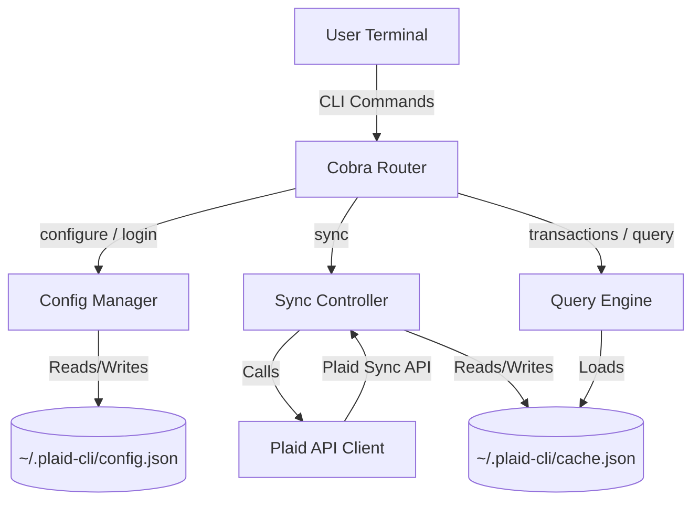

# Plaid CLI: Feature Specification & Architecture Roadmap

This document outlines the design specification and future development roadmap for the `plaid-cli` tool. The goal is to build a robust, secure, and developer-friendly command-line interface for managing personal finance data retrieved via the Plaid API.

---

## 🎯 Vision

`plaid-cli` is a developer-centric personal finance tool that lives in the terminal. It provides:
1. **Full Ownership of Data**: Securely caches all banking records locally in plaintext or encrypted formats.
2. **Aggregated Multi-Account Views**: Seamlessly handles multiple bank accounts, credit cards, and investments across different financial institutions.
3. **Advanced Analytics & Scriptability**: Exposes powerful querying interfaces (SQL, date ranges, filters) and supports clean JSON/CSV exports for piping into other tools.
4. **Actionable CLI Budgets**: Rules engines, category tracking, and ASCII-based visualizations directly in the shell.

---

## 🏗️ Core Architecture



### File Formats & Schema

#### `~/.plaid-cli/config.json`

Stores Plaid API credentials and linked Item metadata.

```json
{
  "client_id": "PLAID_CLIENT_ID",
  "secret": "PLAID_SECRET",
  "environment": "sandbox|production",
  "secure": false,
  "items": [
    {
      "item_id": "item_id_1",
      "access_token": "access-sandbox-xxxxxx",
      "institution_id": "ins_3",
      "institution_name": "Chase"
    }
  ]
}
```

`institution_id` and `institution_name` are fetched from `/item/get` + `/institutions/get_by_id` at link time and cached alongside the token. Any item missing these fields will have them backfilled automatically the next time `accounts remove` is run.

When `secure: true`, the entire file is AES-256-GCM encrypted on disk (see [Local Cache Encryption](#-local-cache-encryption-implemented)).

#### `~/.plaid-cli/cache.json`

Caches cursor checkpoints, full transaction records, and rule-generated overrides locally.

```json
{
  "cursors": {
    "item_id_1": "cursor_string_xyz..."
  },
  "transactions": [
    {
      "transaction_id": "tx_123",
      "account_id":     "acc_abc",
      "amount":         42.50,
      "date":           "2026-05-21",
      "name":           "Target Store",
      "pending":        false,
      "category":       ["Shops", "Supermarkets and Groceries"]
    }
  ],
  "overrides": {
    "tx_abc123": {
      "display_name": "Electric Bill",
      "category":     "Bills & Utilities > Electric",
      "tags":         ["reimbursement"],
      "ignored":      false,
      "rule_id":      "rule_abc123",
      "manual":       false
    }
  }
}
```

#### `~/.plaid-cli/session.json`

Encrypted password session cache (see [Session Caching](#session-caching)).

#### `~/.plaid-cli/rules.json`

User-defined categorization rules (see [Rules Engine](#️-rules-engine--custom-auto-categorization-implemented)).

---

## 🔗 Multi-Account Support (Implemented)

`plaid-cli` supports linking and tracking multiple bank accounts (Plaid Items) simultaneously:

1. **Config Storage**: Access tokens are stored in the `items` list in `config.json`. Institution name and ID are fetched from Plaid at link time and stored with each item so they are available for display without additional API calls.
2. **Aggregated Balance Retrieval**: The `accounts` command fetches balances from all linked items and presents them in a unified table.
3. **Cursor-by-Item Syncing**: `sync` maintains a cursor per Item ID in `cache.json`, ensuring incremental updates are isolated per institution.

### Duplicate Prevention

Before appending a new Item, `login` checks whether the returned `item_id` already exists in `config.json`. If found, the existing entry is updated in place (token + institution metadata refreshed) rather than duplicated. This prevents repeated `login` invocations from accumulating stale entries.

### Account Removal

```text
plaid-cli accounts remove [item_id|account_id|number]
```

On startup, `accounts remove` fetches and backfills any missing `institution_name` values, then:

1. If an argument is given, resolves it in order: **list index** (1-based integer) → **item ID** → **account ID** (walks each item's accounts via Plaid to find the owner).
2. If no argument is given, prints a numbered list of institutions and prompts for a selection.
3. Displays the institution name (not the raw item ID) in the confirmation prompt: `Remove "Chase"? [y/N]`
4. On confirmation:
   - Collects account IDs for the item (needed for cache purge).
   - Calls Plaid `/item/remove` to invalidate the access token server-side.
   - Removes the entry from `config.json`.
   - Deletes the cursor for that item and purges all matching transactions from `cache.json`.
5. Prints how many cached transactions were purged and confirms removal.

**Flags:**

| Flag      | Description                                      |
| ----------- | -------------------------------------------------- |
| `--force` | Skip the confirmation prompt (useful in scripts) |

---

## 🔐 Local Cache Encryption (Implemented)

`config.json` and `cache.json` are encrypted at rest when `secure: true` is set. Encryption is enabled during `configure`.

- **Algorithm**: AES-256-GCM with a key derived from the master password using PBKDF2 (random salt stored in the encrypted envelope).
- **Envelope format**: `{"encrypted": true, "salt": "...", "nonce": "...", "ciphertext": "..."}` — unambiguously detectable so the CLI knows to decrypt before parsing.
- **Password resolution order** (applied to every command that reads config or cache):
  1. In-memory (already entered this process)
  2. `PLAID_CLI_PASSWORD` environment variable
  3. Session cache (`~/.plaid-cli/session.json`) — see below
  4. Interactive terminal prompt (`Enter master password:`)
- **Non-interactive fallback**: if stdin is not a terminal and no password is available via environment or session, the command exits with a clear error.

### Session Caching

To avoid re-entering the master password on every command invocation, the CLI maintains a short-lived session at `~/.plaid-cli/session.json`.

- **Expiry**: 15 minutes from last use. Each successful read slides the window forward.
- **Encryption**: the session file is AES-GCM encrypted using a machine-derived key (SHA-256 of `hostname + home directory path`). This ties the session to the machine without requiring a second password.
- **Permissions**: written with mode `0600`.
- On decryption failure or expiry, the session file is deleted and the user is prompted to re-enter their password.
- `ClearSession()` is called whenever a decryption attempt on config or cache fails, preventing stale session data from blocking access.

**`configure` flags:**

| Flag | Description |
| ------ | ------------- |
| `--secure` | Enable AES-256-GCM encryption for config and cache |

---

## 💳 Plaid Environments & Sandbox Credentials

`plaid-cli` supports two Plaid environments: `sandbox` and `production`.

- **Sandbox**: unlimited test Items, no real bank credentials required.
  - Username: `user_good` / Password: `pass_good`
  - Simulates checking, savings, credit cards, and investments instantly.
  - Can trigger error states (e.g. `ITEM_LOGIN_REQUIRED`) to test re-linking and OAuth flows.
- **Production**: up to 100 live Items on the free Developer tier; full real-bank data.

Historical transaction depth: up to **730 days (2 years)** requested via `SetDaysRequested(730)` in the Link Token. The initial sync delivers the most recent 30 days immediately (`INITIAL_UPDATE`); older history is fetched asynchronously by Plaid in 1–2 minutes and available after a second `sync` run (`HISTORICAL_UPDATE`).

---

## 🛠️ Implemented Commands

### `configure`

Set up Plaid API credentials. Prompts interactively for any values not supplied via flags. Re-running `configure` preserves existing linked Items.

| Flag | Description |
| ------ | ------------- |
| `--client-id` | Plaid Client ID |
| `--secret` | Plaid Client Secret |
| `--environment` | `sandbox` or `production` |
| `--secure` | Enable AES-256-GCM encryption |

### `login`

Open a browser-based Plaid Link flow via a temporary local server to authenticate a bank account. Exchanges the public token for an access token, fetches institution metadata, and stores everything in `config.json`. Safe to run multiple times — duplicate item IDs are updated rather than duplicated.

| Flag | Description |
| ------ | ------------- |
| `--port` | Local port for the Link flow page (default `8080`) |

### `accounts`

Fetch and display real-time balances for all linked items in a unified table (account ID, name, type/subtype, current balance, available balance, currency).

#### `accounts remove [item_id|account_id|number]`

Remove a linked institution. See [Account Removal](#account-removal) for full behavior.

| Flag | Description |
| ------ | ------------- |
| `--force` | Skip confirmation prompt |

### `sync`

Incrementally fetch transaction changes (added, modified, removed) from Plaid using cursor-based sync and write them to `cache.json`. After saving, automatically runs all enabled rules against the changed transactions and reports the override count.

| Flag | Description |
| ------ | ------------- |
| `--item-id` | Sync only the specified Plaid Item ID |
| `--account-id` | Resolve to the parent item and sync only that institution |
| `--reset` | Clear cursors and re-fetch full history from scratch |

`--item-id` and `--account-id` are mutually exclusive. `--reset` with a targeted flag resets only the matched item's cursor and cached transactions.

### `transactions`

Query and display transactions from the local cache with extensive filtering. Sorted by date descending. When run in a terminal with no date filter specified, presents an interactive prompt:

```
[1] Last 30 days
[2] Last 60 days
[3] Last 90 days
[4] All transactions (no filter)
```

In non-interactive (piped) mode, defaults to all transactions.

| Flag | Description |
| ------ | ------------- |
| `--start-date YYYY-MM-DD` | Show transactions on or after this date |
| `--end-date YYYY-MM-DD` | Show transactions on or before this date |
| `--days N` | Show transactions from the last N days (mutually exclusive with `--start-date`/`--end-date`) |
| `--account-id` | Filter by Plaid account ID |
| `--min-amount` | Lower bound (inclusive) on transaction amount |
| `--max-amount` | Upper bound (inclusive) on transaction amount |
| `--search` | Case-insensitive substring search on transaction name |
| `--pending` | Show only pending transactions |
| `--limit N` | Cap the number of displayed results (default 100) |
| `--format table\|json\|csv` | Output format (default `table`) |
| `--output FILE` | Write output to a file instead of stdout |
| `--no-rules` | Show raw Plaid data without applying rule overrides |
| `--tag TAG` | Show only transactions with this override tag |
| `--ignored` | Show only transactions marked ignored by a rule |

---

## 🏷️ Rules Engine & Custom Auto-Categorization (Implemented)

Plaid's default transaction categorization can be noisy or inaccurate. A local rules engine allows users to override names, categories, and tags without mutating raw Plaid data.

**Non-destructive override layer.** Rules never modify `transactions[]`. Instead, `cache.json` carries an `overrides` map keyed by `transaction_id`. Rules populate this map; `transactions` merges overrides at render time. Manual per-transaction edits (future TUI feature) coexist here — `manual: true` overrides take priority over rule-generated ones.

### `~/.plaid-cli/rules.json` schema

```json
{
  "rules": [
    {
      "id": "rule_abc123",
      "name": "Venmo Electric Bill",
      "enabled": true,
      "conditions": {
        "name_contains": "VENMO",
        "amount_min": 50.0,
        "amount_max": 200.0
      },
      "actions": {
        "rename": "Electric Bill",
        "set_category": "Bills & Utilities > Electric",
        "tags": ["reimbursement"],
        "ignore": false
      }
    }
  ]
}
```

**Conditions** (all present conditions must match — AND logic):

| Field | Match type |
| ------- | ----------- |
| `name_contains` | Case-insensitive substring on transaction name |
| `name_regex` | Full Go regex on transaction name |
| `account_id` | Exact match on Plaid account ID |
| `amount_min` / `amount_max` | Inclusive bounds on transaction amount |
| `category_is` | Case-insensitive substring on Plaid's auto-assigned category string |

**Actions** (all non-empty fields applied):

| Field | Effect |
| ------- | -------- |
| `rename` | Display name override |
| `set_category` | User-defined category string |
| `tags` | String slice (e.g. `["tax-deductible", "reimbursable"]`) |
| `ignore` | `true` hides the transaction from budget/spend summaries |

### Rules commands

| Command | Flags | Description |
| --------- | ------- | ------------- |
| `rules list` | `--format table\|json` | Print all rules |
| `rules add` | `--name`, `--match`, `--regex`, `--account-id`, `--min-amount`, `--max-amount`, `--category-is`, `--set-category`, `--rename`, `--tag` (repeatable), `--ignore` | Add a rule; prompts interactively for omitted fields when run in a terminal |
| `rules remove <id>` | — | Delete a rule by ID |
| `rules enable <id>` | — | Enable a disabled rule |
| `rules disable <id>` | — | Disable a rule without deleting it |
| `rules apply` | `--dry-run` | Re-run all enabled rules against the full cache; `--dry-run` prints matches without writing |
| `rules test` | `--match`, `--regex`, `--min-amount`, `--max-amount` | Dry-run a one-off condition against the cache and print matches |

> **Note**: `rules test` supports only name/amount conditions. To test `account_id` or `category_is` conditions, use `rules add` without saving (Ctrl-C) or `rules apply --dry-run` after temporarily adding the rule.

### Integration with `sync` and `transactions`

- `sync` — after saving the cache, automatically calls `rules.ApplyAll()` on newly added/modified transaction IDs only. Reports the override count in the sync summary.
- `transactions` — after filtering, calls `rules.MergeOverrides()` to produce display-ready records before rendering. `--no-rules` bypasses this and shows raw Plaid data. `--tag` and `--ignored` filter on override fields.

---

## 🚀 Roadmap

### 📊 1. SQLite / SQL Query Interface

Allow querying transactions using standard SQL.

- Add a `query` command: `plaid-cli query "<SQL>"`
- Spin up an in-memory SQLite database, auto-generate schemas for `transactions` and `accounts`, load cache records into tables, and execute the query.

```bash
plaid-cli query "SELECT category, SUM(amount) FROM transactions WHERE date >= '2026-05-01' GROUP BY category ORDER BY SUM(amount) DESC"
```

### 💻 2. TUI / Interactive Dashboard

An interactive Terminal UI via `bubbletea` or `tview`:

- `plaid-cli dashboard` / `plaid-cli shell`
- **Overview**: net-worth, spend vs. income progress bar, credit utilization.
- **Transaction Browser**: scrollable list with search and detail pane.
- **Recategorization Wizard**: fast flow to assign categories to transactions.
- **Budget Progress**: ASCII progress bars against monthly caps.

### 🔌 3. Auto-Export Integrations

- `plaid-cli export sheets` — append transactions to a Google Sheets workbook.
- `plaid-cli export ledger` — output in Ledger/Beancount plain-text accounting format.

### 📈 4. Monthly Reports & ASCII Visualizations

```text
=====================================================
            SPENDING SUMMARY: MAY 2026
=====================================================
Total Spent:  $3,420.50
Total Income: $5,100.00
Net Savings:  +$1,679.50 (32.9%)

Spend by Category:
-----------------------------------------------------
[Food & Dining]    ████████████░░░░░░░░  $450.00 (13.1%)
[Rent & Utilities] ████████████████████  $1,200.00 (35.0%)
[Transportation]   ████░░░░░░░░░░░░░░░░  $150.00 (4.3%)
[Entertainment]    ████████░░░░░░░░░░░░  $320.00 (9.3%)
[Investments]      ██████████████░░░░░░  $800.00 (23.3%)
[Misc]             ████████░░░░░░░░░░░░  $500.00 (14.6%)
-----------------------------------------------------
```

Commands: `report monthly --month YYYY-MM`, `report budget`

### 🏦 5. Additional Plaid Products

| Command | Description |
| --------- | ------------- |
| `networth --include-brokerages` | Aggregated assets, liabilities, and calculated net worth |
| `identity --format table\|json` | Verified account owner names, emails, phones, addresses |
| `routing` | ABA routing and account numbers for ACH setup |

---

## 🤝 Next Development Steps

1. **TUI App**: scaffold `pkg/tui/` with a bubble model and update cycle.
2. **Monthly Report**: implement `report monthly` using the existing cache + override merge pipeline.
