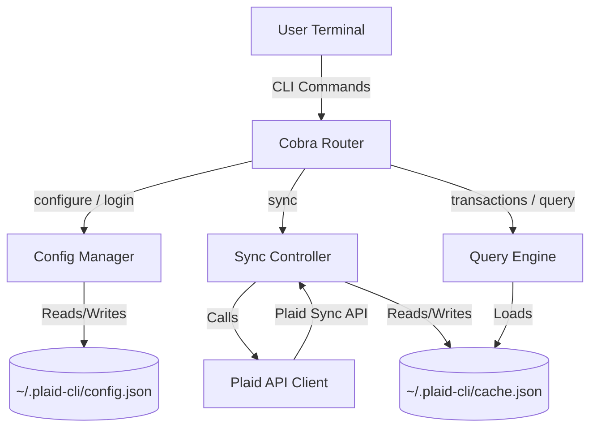

# Plaid CLI: Feature Specification & Architecture Roadmap

This document outlines the design specification and future development roadmap for the `plaid-cli` tool. The goal is to build a robust, secure, and developer-friendly command-line interface for managing personal finance data retrieved via the Plaid API.

---

## 🎯 Vision

`plaid-cli` is a developer-centric personal finance tool that lives in the terminal. It provides:
1. **Full Ownership of Data**: Securely caches all banking records locally in plaintext or encrypted formats.
2. **Aggregated Multi-Account Views**: Seamlessly handles multiple bank accounts, credit cards, and investments across different financial institutions.
3. **Advanced Analytics & Scriptability**: Exposes powerful querying interfaces (SQL, date ranges, filters) and supports clean JSON/CSV exports for piping into other tools.
4. **Actionable CLI Budgets**: Rules engines, category tracking, and ASCII-based visualizations directly in the shell.

---

## 🏗️ Core Architecture



### 1. File Formats & Schema

#### `~/.plaid-cli/config.json`
Stores user credentials and links to Plaid Items.
```json
{
  "client_id": "PLAID_CLIENT_ID",
  "secret": "PLAID_SECRET",
  "environment": "sandbox|production",
  "items": [
    {
      "item_id": "item_id_1",
      "access_token": "access-sandbox-xxxxxx"
    }
  ]
}
```

#### `~/.plaid-cli/cache.json`
Caches cursor checkpoints and full transaction records locally.
```json
{
  "cursors": {
    "item_id_1": "cursor_string_xyz..."
  },
  "transactions": [
    {
      "transaction_id": "tx_123",
      "account_id": "acc_abc",
      "amount": 42.50,
      "date": "2026-05-21",
      "name": "Target Store",
      "pending": false,
      "category": ["Shops", "Supermarkets and Groceries"]
    }
  ]
}
```

---

## 🔗 Multi-Account Support (Implemented)

`plaid-cli` supports linking and tracking multiple bank accounts (Plaid Items) simultaneously:
1. **Config Storage**: Access tokens are stored in the list `items` under `config.json`. When logging in, the CLI checks the `item_id`; if it is a new account, it is appended to the list, preventing any loss of previously authenticated accounts.
2. **Aggregated Balance Retrieval**: The `accounts` command fetches balance details from all access tokens stored in `config.json` and presents them in a unified summary list.
3. **Cursor-by-Item Transaction Syncing**: The `sync` command maps cursors per Item ID (`Cursors` map in `cache.json`), ensuring incremental updates (additions, modifications, deletions) are performed correctly for each linked bank feed without overlapping cursor mismatches.

---

## 💳 Plaid Trial & Developer License Capabilities

When running with a Plaid **Trial** or **Developer** API license (Sandbox and limited Live access), the CLI can take advantage of several specific Plaid endpoints and behaviors:

### 1. Available Products & Capabilities
*   **Transactions**:
    *   Allows requesting up to **730 days (2 years)** of historical transactions by configuring `SetDaysRequested(730)` during the Link Token generation.
    *   Initial sync runs immediately download the most recent 30 days of data (`INITIAL_UPDATE`). Older historical data is fetched asynchronously by Plaid in the background over 1–2 minutes, firing a `HISTORICAL_UPDATE` webhook when complete. Re-syncing after a short delay gathers the full history.
*   **Balance**:
    *   Retrieves real-time account balances (current and available) without waiting for daily bank updates.
*   **Auth (Bank Routing & Account Numbers)**:
    *   Exchanges tokens for routing and account numbers for checking and savings accounts (for payment/ACH setup purposes).
*   **Identity**:
    *   Retrieves name, email address, phone number, and physical address associated with the account holder to verify identity.
*   **Investments (Holdings & Investment Transactions)**:
    *   Retrieves real-time brokerage holdings (security tickers, quantity, current value, cost basis) and historical buy/sell/dividend transaction records.
*   **Liabilities (Credit Cards & Loans)**:
    *   Gathers detailed loan structures: credit card statement balances, minimum payment due dates, and student/mortgage loan interest rates, maturities, and balances.

### 2. Limits and Environment Sandbox
*   **Item Limits**: Developer mode allows linking up to **100 live Items** (institutions) for free. Sandbox mode allows unlimited test connections.
*   **Sandbox Credentials**:
    *   **Username**: `user_good`
    *   **Password**: `pass_good`
    *   Allows choosing any institution, and simulates account states (checking, savings, credit cards, investments) instantly.
    *   Can trigger specific errors (e.g. `ITEM_LOGIN_REQUIRED`) to test re-linking flows and OAuth redirection flows.

---

## 🚀 Feature Specification Roadmap

### 🔐 1. Local Cache Encryption (Security)
To ensure sensitive financial data is not stored in plaintext on disk, the configuration and cache files will support password-based encryption.
*   **Specification**:
    *   Add a `--secure` flag or configuration setting.
    *   Encrypt `config.json` and `cache.json` using **AES-256-GCM** derived from a user-provided master password via PBKDF2.
    *   Prompt for the password on commands that read/write configuration or cache (e.g. `sync`, `transactions`, `accounts`), or optionally read it from a standard environment variable (`PLAID_CLI_PASSWORD`) or system keyring.

### 📊 2. SQLite / SQL Query Interface (Analytics)
Instead of building custom command-line filters for every possible query, the CLI will allow querying transactions using standard SQLite/SQL queries.
*   **Specification**:
    *   Add a `query` command: `plaid-cli query "<SQL_QUERY>"`
    *   On invocation, spin up an in-memory SQLite database (`:memory:`).
    *   Auto-generate schemas for `transactions` and `accounts`, load the JSON cache records into tables, and execute the user's raw SQL query against it.
    *   **Example**:
        ```bash
        plaid-cli query "SELECT category, SUM(amount) FROM transactions WHERE date >= '2026-05-01' GROUP BY category ORDER BY SUM(amount) DESC"
        ```

### 🏷️ 3. Rules Engine & Custom Auto-Categorization
Plaid's default transaction categorization can be noisy or inaccurate. A local rules engine will allow users to override categories dynamically.
*   **Specification**:
    *   Support a local `rules.json` file where users define rules matching merchant names or account IDs.
    *   Provide commands to manage rules: `plaid-cli rules add --match "Uber" --set-category "Transport > Ride Share"`.
    *   On transaction sync/load, execute these rules in sequence, replacing the transaction's category field or adding a custom user-defined category tag.

### 💻 4. TUI / Interactive Dashboard (REPL Mode)
An interactive Terminal User Interface (TUI) built using a Go library like `bubbletea` or `tview`.
*   **Specification**:
    *   Start the interactive dashboard: `plaid-cli dashboard` or `plaid-cli shell`
    *   **Views**:
        *   **Overview Screen**: Total net-worth balance, spend vs. income progress bar, and credit card limit utilization.
        *   **Transaction Browser**: Interactive list where users can scroll, search, and details-pane single transactions.
        *   **Recategorization Wizard**: Fast UI flow to select transactions and assign categories.
        *   **Budget Progress**: Visual progress bars representing monthly budgets.

### 🔌 5. Auto-Export Integrations (Notion, Google Sheets, Ledger)
Enable syncing transaction caches directly to third-party endpoints.
*   **Specification**:
    *   `plaid-cli export sheets` - Appends new transactions to a Google Sheets workbook.
    *   `plaid-cli export notion` - Syncs transactions to a Notion Database.
    *   `plaid-cli export ledger` - Outputs transactions in Ledger/Beancount plain-text accounting format.

---

## 🛠️ CLI Command Design

The following table lists proposed new commands and their flags:

| Command | Subcommand | Flags | Description |
| :--- | :--- | :--- | :--- |
| `query` | - | `--format [table/json/csv]` | Execute raw SQL query against the cache |
| `rules` | `list` | - | List all user-defined categorization rules |
| `rules` | `add` | `--match`, `--category` | Add a regex-based categorization rule |
| `report` | `monthly` | `--month YYYY-MM` | Print a categorized monthly spend summary |
| `report` | `budget` | - | Display spending vs. budget caps in ASCII |
| `export` | `sheets` | `--spreadsheet-id` | Sync cached transactions to Google Sheets |
| `export` | `ledger` | `--output file.journal` | Export to plain-text accounting journal format |
| `dashboard`| - | - | Launch the Bubble Tea interactive Terminal UI |
| `networth` | - | `--include-brokerages` | Display aggregated assets, liabilities, and calculated net worth |
| `identity` | - | `--format [table/json]` | Retrieve verified account owner names, emails, phones, and addresses |
| `routing` | - | - | Retrieve ABA/ETF routing and account numbers for checking/savings accounts |

---

## 📈 Monthly Report & ASCII Visualization Mockup

When running `plaid-cli report monthly`, the tool should render beautiful CLI summaries, complete with Sparklines/ASCII charts:

```text
=====================================================
            SPENDING SUMMARY: MAY 2026              
=====================================================
Total Spent:  $3,420.50
Total Income: $5,100.00
Net Savings:  +$1,679.50 (32.9%)

Spend by Category:
-----------------------------------------------------
[Food & Dining]    ████████████░░░░░░░░  $450.00 (13.1%)
[Rent & Utilities] ████████████████████  $1,200.00 (35.0%)
[Transportation]   ████░░░░░░░░░░░░░░░░  $150.00 (4.3%)
[Entertainment]    ████████░░░░░░░░░░░░  $320.00 (9.3%)
[Investments]      ██████████████░░░░░░  $800.00 (23.3%)
[Misc]             ████████░░░░░░░░░░░░  $500.00 (14.6%)
-----------------------------------------------------
```

---

## 🤝 Next Steps & Development Sandbox

1.  **SQLite Support**: Run `go get github.com/mattn/go-sqlite3` or pure Go driver `modernc.org/sqlite` to implement `plaid-cli query`.
2.  **Rules Engine**: Create `pkg/rules/rules.go` to handle regex parsing on merchant names.
3.  **TUI App**: Create `pkg/tui/` and structure the main bubble model and update cycle.
